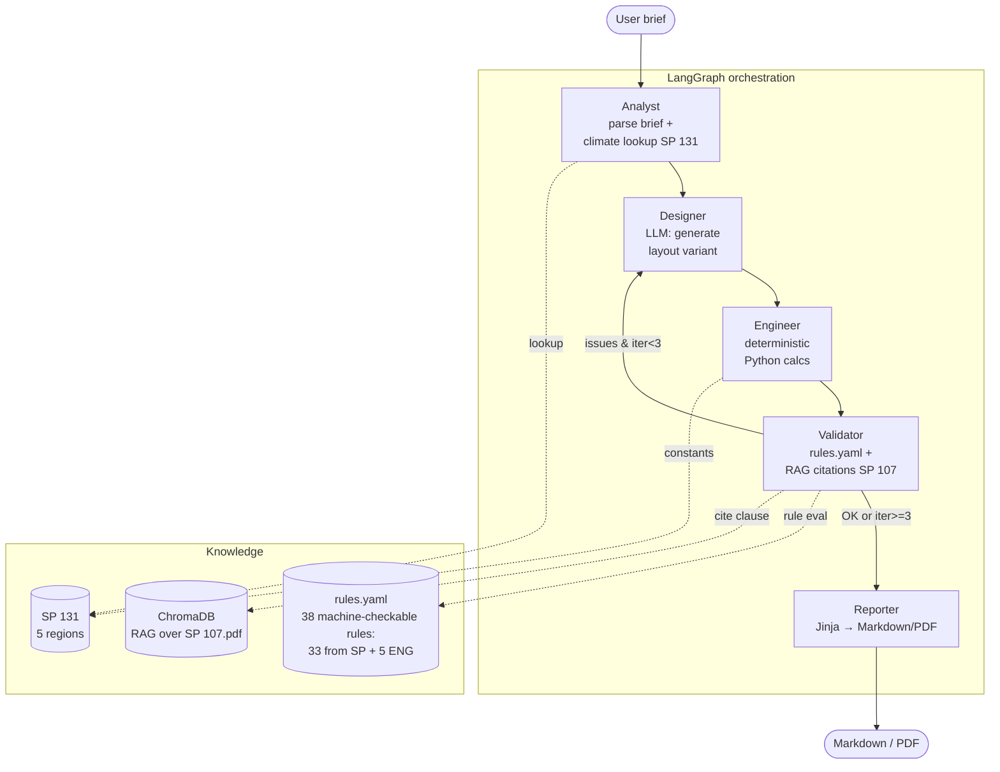

# Agro Greenhouse Designer

🌍 **English** · [Русский](README.md)

[](https://github.com/JukPelme/agro-greenhouse-designer/actions/workflows/ci.yml)
[](https://www.python.org/downloads/)
[](LICENSE)
[](https://github.com/langchain-ai/langgraph)
[](https://streamlit.io)
[](https://agro-greenhouse-designer-93jbgusctbn6a7xzevt5px.streamlit.app/)

Multi-agent system for pre-design of greenhouse complexes, with automatic
validation against the Russian construction standard **SP 107.13330.2012
"Greenhouses and hotbeds"** (the updated edition of SNiP 2.10.04-85).

A portfolio project illustrating the pattern **LLM agents + deterministic
calculations + RAG over building codes**.

🟢 **Live demo:** https://agro-greenhouse-designer-93jbgusctbn6a7xzevt5px.streamlit.app/
— opens on the cached happy-path run; the sidebar lets you switch to the
refusal case.

> This is a pet project, not a certified design tool. Outputs are pre-design
> estimates and require validation by a qualified engineer.

---

## What the system does

**Input** — a design brief: greenhouse type, crop, target yield, region, plot
dimensions.

**Output** — a Markdown/PDF report with:
- a proposed layout (block geometry, covering material, auxiliary zones);
- engineering calculations (heat losses, water demand, lighting, ventilation,
  loads);
- a validation pass against SP 107.13330 with **verbatim citations from the
  PDF** for every issue found.

---

## Architecture



### Why multi-agent

The whole pipeline could be one big prompt. It isn't, deliberately — each step
has a different nature:

- **Designer** — generation (LLM is good at this)
- **Engineer** — arithmetic (LLM is bad; isolated in pure Python with pytest)
- **Validator** — rule evaluation + source citation (deterministic + RAG)
- **Reporter** — template rendering (no LLM at all)

Each agent is a typed node in the graph with a clear interface through
`GraphState`. Isolated debugging. Full trace available in LangSmith when
configured.

### Hybrid LLM + deterministic calculations

Hard rule of the system: **the LLM does not produce numbers**. Designer picks
geometry and materials, but heat loss is computed by `src/calc/heat.py` with
the classic `Q = U·F·ΔT`. This guards against hallucinated kilowatts and
cubic metres.

> **Rule scope.** v2 covers 33 machine-checkable requirements from SP 107.13330
> + 5 engineering sanity checks (38 total, see [data/rules.yaml](data/rules.yaml)).
> Extracted from 83 machine-checkable provisions in the document (full list in
> commit history). Domains covered: geometry (layout, spans, slopes),
> materials (glass, loads), hvac (coolant, ventilation), water (reliability,
> drainage), light (illuminance), loads (overload factors). Wording is
> cross-checked against verbatim citations from the indexed PDF.

## Failed case (more important than happy path)

The system **knows how to say no**. Example:

> Brief: year-round tomato greenhouse on a 25×20 m (500 m²) plot in
> Novosibirsk Oblast, target 2000 t/year, requires ≥ 2 blocks.

Designer first tries to squeeze impossibly. Validator catches the violations,
Designer **iteratively adapts** while staying within SP limits:

- v1 → ERROR SP107.4.4-year-round (spacing < 6 m) + WARNING ENG.2-aux-share
  (aux zones too small)
- v2 → Designer raises block_spacing_m to 10 m and aux share to 16%,
  spelling out the fixes in the rationale
- v2 → only WARNING SP107.7.18-south remains: vent opening < 20% of envelope
  (physically unavoidable on 500 m² with two blocks)

Designer honestly records the contradictions in the rationale and adapts to
validator feedback instead of fabricating a plausible-but-false answer. Every
warning carries a verbatim citation from the relevant SP clause via RAG. See
the full report in [docs/failed_example.md](docs/failed_example.md).

Cached examples in the repo:
- [docs/example_report.md](docs/example_report.md) and
  [docs/report_v1.pdf](docs/report_v1.pdf) — happy-path run
- [docs/failed_example.md](docs/failed_example.md) and
  [docs/report_failed_v1.pdf](docs/report_failed_v1.pdf) — refusal case

---

## Stack

- **Python 3.12**
- **LangGraph** — agent-graph orchestration
- **Anthropic Claude**: Sonnet 4.6 for Designer, Haiku 4.5 for parsing. Opus
  4.7 available via `get_llm(_OPUS_MODEL)` when maximum reasoning is needed.
  Validator runs without an LLM — pure Python logic + RAG. Direct Anthropic
  SDK, no intermediaries.
- **Pydantic v2** — typed state and structured LLM output
- **ChromaDB** — RAG over the full SP 107.13330 PDF
- **pytest** — guard rails for the calculation core
- **Streamlit** — demo UI
- **LangSmith** — graph traces, enabled by setting `LANGSMITH_API_KEY`
  (free tier ~5000 runs/month)

---

## Demo

👉 **Open right now:** https://agro-greenhouse-designer-93jbgusctbn6a7xzevt5px.streamlit.app/

Three modes in the sidebar:
- **Cached happy path** (default) — replays the cached report without any LLM
  calls
- **Cached refusal** — failed case with a real SP 107 clause 4.4 citation
- **Run live** — paste your own `ANTHROPIC_API_KEY` in the sidebar; the graph
  runs on the fly

Cached modes work without an API key and spend no tokens.

## Install & run

```bash
git clone https://github.com/JukPelme/agro-greenhouse-designer
cd agro-greenhouse-designer

# uv recommended
uv venv --python 3.12
uv pip install -e ".[dev]"

# or the classic way
python3.12 -m venv .venv && source .venv/bin/activate
pip install -e ".[dev]"
```

### Configure

```bash
cp .env.example .env
# fill in ANTHROPIC_API_KEY
```

### Build the SP 107 RAG index

```bash
python scripts/build_rag.py
# creates chroma_db/ from data/sp_107.pdf
```

### Run tests

```bash
pytest -v
```

### Run the UI

```bash
streamlit run ui/app.py
```

### Deploy on Streamlit Cloud

1. Sign in at [share.streamlit.io](https://share.streamlit.io) with GitHub
2. New app → pick your fork / own repo
3. Branch: `main`, main file: `ui/app.py`, Python: `3.12`
4. The URL appears in 2-3 minutes (`name.streamlit.app`)

You may optionally drop `ANTHROPIC_API_KEY` into Settings → Secrets so the
live mode works out of the box. Not recommended for a public demo — visitors
will burn your tokens.

---

## Project layout

```
agro-greenhouse-designer/
├── src/
│   ├── agents/          # 5 graph nodes: analyst, designer, engineer, validator, reporter
│   ├── calc/            # deterministic calcs (heat, water, lighting, vent, structural)
│   ├── rag/             # rules_engine + sp_index (ChromaDB) + climate_lookup
│   ├── schemas/         # Pydantic state, project, design, calc_results, validation
│   ├── render/          # Markdown → PDF via weasyprint
│   ├── viz/             # matplotlib charts for the report
│   ├── templates/       # Jinja2 report template
│   ├── graph.py         # LangGraph orchestration
│   └── llm.py           # Anthropic LLM factory
├── data/
│   ├── sp_107.pdf       # SP 107.13330.2012 (open access, Ministry of Construction)
│   └── rules.yaml       # 24 rules: 20 SP 107 clauses + 4 ENG sanity checks
├── tests/               # pytest for calc core and rules engine
├── ui/
│   ├── app.py           # Streamlit UI
│   └── i18n.py          # RU/EN translations
├── scripts/
│   ├── build_rag.py     # build ChromaDB from PDF
│   ├── build_demo_cache.py     # record happy-path run for the demo
│   └── build_failed_case.py    # record refusal-case run
├── demo_cache/          # cached runs (JSON) so the demo works without a key
└── docs/                # example_report.md, charts, PDFs
```

---

## Explicitly out of scope

- **Related SPs** (SP 50 thermal protection, SP 20 loads, SP 30 water supply) —
  Validator hints at them only, not full RAG inclusion. Production version
  would add separate indexes.
- **CAD output** (DWG/Revit/IFC) — not in. Report is text + tables + charts.
- **Dynamic modeling** (TRNSYS/EnergyPlus) — calcs are static, point values
  `t5` and `t_summer`. Enough for pre-design, not for detailed documentation.
- **Billing, multi-tenancy, auth** — portfolio project, not SaaS.

## Roadmap (if pushed further)

- [ ] Full SP 107 parser with automatic `rules.yaml` generation
- [ ] Connect SP 50 and SP 20 as separate RAG indexes
- [ ] Expand `climate_lookup` to the full list of regions from SP 131
- [ ] Generate the master plan as SVG/DXF
- [ ] Extend to other types of agricultural facilities (livestock, grain
      storage)

---

## API key safety in live mode

Live mode requires the visitor to paste an `ANTHROPIC_API_KEY` into the
sidebar. To keep this transparent:

- The input field is `type="password"` — characters are masked.
- The key is placed in `os.environ` of the running process and goes nowhere
  else: not to files, not into LangSmith traces (its own key is separate),
  not into app logs.
- Streamlit clears widget state on page reload — the key disappears.
- A "Clear key from session" button in the sidebar pops the env var and
  reruns the app.
- HTTPS end to end: browser → Streamlit Cloud → Anthropic API.

What we don't promise:
- Streamlit Cloud sees the key in process memory like any other user input.
  Fine for a one-off test, use a self-hosted deployment for production.
- No defense against phishing copies on a similar URL — standard web hygiene
  applies.

Corporate-user-recommended path: clone the repo and run
`streamlit run ui/app.py` locally with the key from `.env`.

## License

MIT. See [LICENSE](LICENSE).
