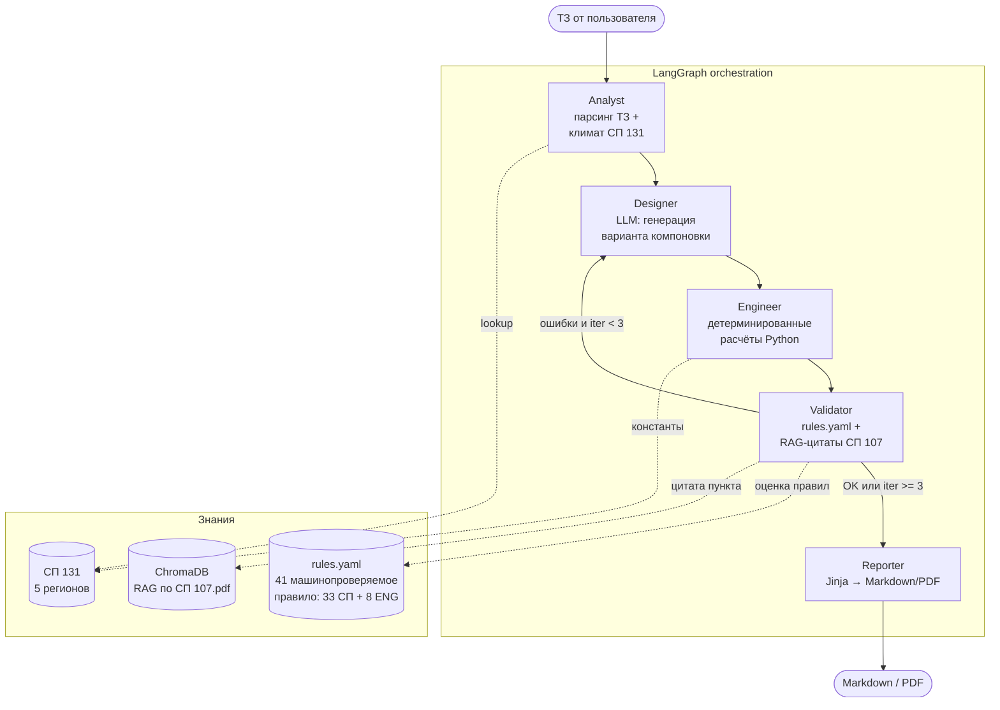

# Agro Greenhouse Designer

🌍 [English](README.en.md) · **Русский**

[](https://github.com/JukPelme/agro-greenhouse-designer/actions/workflows/ci.yml)
[](https://github.com/JukPelme/agro-greenhouse-designer/actions/workflows/security.yml)
[](https://www.python.org/downloads/)
[](LICENSE)
[](https://github.com/langchain-ai/langgraph)
[](https://streamlit.io)
[](https://agro-greenhouse-designer-93jbgusctbn6a7xzevt5px.streamlit.app/)

Мультиагентная система предпроектной разработки тепличных комплексов с автоматической проверкой по **СП 107.13330.2012 «Теплицы и парники»** (актуализированная редакция СНиП 2.10.04-85).

Портфолио-проект, иллюстрирующий паттерн **LLM-агенты + детерминированные расчёты + RAG по нормативам**.

🟢 **Live demo:** https://agro-greenhouse-designer-93jbgusctbn6a7xzevt5px.streamlit.app/ — открывается на готовый прогон, в сайдбаре можно переключить на failed-case.

> Это пет-проект, а не сертифицированный инструмент проектирования. Выходные расчёты — предпроектные и требуют верификации специалистом.

---

## Что делает система

На входе — техническое задание (ТЗ): тип теплицы, культура, целевая урожайность, регион, размеры участка.

На выходе — отчёт в Markdown/PDF с:
- проектным решением (геометрия блоков, материал ограждения, подсобки);
- инженерными расчётами (теплопотери, водопотребление, освещённость, вентиляция, нагрузки);
- проверкой по СП 107.13330 с **цитированием пунктов норматива** и указанием конкретных нарушений.

---

## Архитектура



### Зачем мультиагент

Можно было бы запихнуть всё в один большой промпт. Не запихнул специально — задача рассыпается на этапы с разной природой:

- **Designer** — генерация (LLM хорош)
- **Engineer** — арифметика (LLM плох; вынесено в чистый Python с pytest)
- **Validator** — проверка правил + ссылка на источник (детерминированно + RAG)
- **Reporter** — рендеринг шаблона (без LLM вообще)

Каждый агент = отдельная функция-нода с типизированным интерфейсом через `GraphState`. Отлаживается изолированно. При наличии `LANGSMITH_API_KEY` и `LANGSMITH_TRACING=true` в окружении langgraph автоматически отправляет полный trace каждой ноды (inputs/outputs/timings) — никаких правок в коде, см. [.env.example](.env.example).

### Гибрид LLM + детерминированные расчёты

Принципиальное ограничение: **LLM не производит чисел**. Designer выбирает геометрию и материал, но теплопотери считает `src/calc/heat.py` по формуле `Q = U·F·ΔT`. Это страховка от галлюцинаций в кВт и метрах кубических.

---


> **Скоуп правил.** В v2 покрыто 33 машинопроверяемых требования из СП 107.13330 + 8 инженерных sanity-проверок (всего 41, см. [data/rules.yaml](data/rules.yaml)). Извлечены из 83 машинопроверяемых положений документа (полный список в коммитах). Покрытые домены: geometry (планировка, пролёты, уклоны), materials (стекло, нагрузки), hvac (теплоноситель, вентиляция), water (надёжность, дренаж), light (освещённость), loads (коэффициенты перегрузки). Формулировки сверены с дословными цитатами из проиндексированного PDF.

## Failed case (важнее happy path)

Система **умеет говорить «нет»**. Пример:

> ТЗ: круглогодичная теплица для томата на участке 25×20 м (500 м²) в Новосибирской области, цель 2000 т/год, обязательно ≥2 блока.

Designer пытается уложиться в физически невозможные ограничения. Validator ловит нарушения, Designer **итеративно адаптирует** компоновку, но физический предел ловит ENG.5:

- 3 итерации Designer→Validator, ни одна не проходит
- `ERROR ENG.5-yield-feasibility` — площадь блоков физически вмещает ~4 т/год при цели 2000 т (томат при норме 50 кг/м² × 72 м² построенных)
- `WARNING SP107.7.18-south` — площадь проёмов вентиляции < 20% (физически неизбежно)
- `WARNING ENG.2-aux-share` — Designer вынужден отдать 83% участка под подсобки

Designer честно фиксирует противоречия в обосновании и адаптируется к замечаниям. Каждое предупреждение сопровождается дословной цитатой соответствующего пункта СП через RAG. См. полный отчёт в [docs/failed_example.md](docs/failed_example.md).

Готовые примеры в репо:
- [docs/example_report.md](docs/example_report.md) и [docs/report_v1.pdf](docs/report_v1.pdf) — нормальный прогон
- [docs/failed_example.md](docs/failed_example.md) и [docs/report_failed_v1.pdf](docs/report_failed_v1.pdf) — противоречивое ТЗ

---

## Стек

- **Python 3.12**
- **LangGraph** — оркестрация графа агентов
- **Anthropic Claude**: Sonnet 4.6 для Designer, Haiku 4.5 для парсинга. Opus 4.7 доступен через `get_llm(_OPUS_MODEL)` если нужно максимум reasoning. Validator — без LLM, чистая Python-логика + RAG. Прямой Anthropic SDK, без посредников
- **Pydantic v2** — типизированный state и структурированный вывод LLM
- **ChromaDB** — RAG по полному PDF СП 107.13330
- **pytest** — guard-rails для расчётного ядра
- **Streamlit** — демо-UI
- **LangSmith** — трейсы графа, включается переменной `LANGSMITH_API_KEY` (бесплатный tier ~5000 прогонов/мес)

---

## Демо

👉 **Открыть прямо сейчас:** https://agro-greenhouse-designer-93jbgusctbn6a7xzevt5px.streamlit.app/

В сайдбаре доступны три режима:
- **Готовый прогон — норма** (по умолчанию) — проигрывание закэшированного отчёта без вызовов LLM
- **Готовый прогон — отказ** — failed-case с реальной цитатой п. 4.4 СП 107
- **Запустить вживую** — пользователь вставляет свой  в сайдбар, граф выполняется на лету

Демо-режимы работают без API-ключа и не тратят токены.

## Запуск

### Установка

```bash
git clone <repo>
cd agro-greenhouse-designer

# uv рекомендуется
uv venv --python 3.12
uv pip install -e ".[dev]"

# или классически
python3.12 -m venv .venv && source .venv/bin/activate
pip install -e ".[dev]"
```

### Конфигурация

```bash
cp .env.example .env
# впишите ANTHROPIC_API_KEY
```

### Построить RAG-индекс СП 107

```bash
python scripts/build_rag.py
# создаст chroma_db/ из data/sp_107.pdf
```

### Запустить тесты

```bash
pytest -v
```

### Запустить UI

```bash
streamlit run ui/app.py
```

### Деплой на Streamlit Cloud

1. На [share.streamlit.io](https://share.streamlit.io) — войти через GitHub
2. New app → выбрать форк / свой репо
3. Branch: `main`, Main file: `ui/app.py`, Python: `3.12`
4. Через 2-3 минуты будет URL вида `name.streamlit.app`

В Settings → Secrets можно положить `ANTHROPIC_API_KEY` для live-режима из коробки (не рекомендуется для публичного демо — посетители будут жечь токены).

UI работает в двух режимах:
- **Демо-режим** — проигрывает заранее закэшированный прогон из `demo_cache/`. Не требует API-ключа, не тратит токены. Подходит для просмотра без затрат.
- **Свой ключ** — пользователь вставляет свой `ANTHROPIC_API_KEY` в сайдбар, граф выполняется вживую.

Чтобы создать демо-кэш:
```bash
python scripts/build_demo_cache.py
```

---

## Структура

```
agro-greenhouse-designer/
├── src/
│   ├── agents/          # 5 нод графа: analyst, designer, engineer, validator, reporter
│   ├── calc/            # детерминированные расчёты (heat, water, lighting, vent, structural)
│   ├── rag/             # rules_engine + sp_index (ChromaDB) + climate_lookup
│   ├── schemas/         # Pydantic state, project, design, calc_results, validation
│   ├── templates/       # Jinja2-шаблоны отчёта
│   ├── graph.py         # LangGraph orchestration
│   └── llm.py           # Anthropic LLM factory
├── data/
│   ├── sp_107.pdf       # СП 107.13330.2012 (open access, Минстрой)
│   └── rules.yaml       # 24 правила: 20 пунктов СП 107.13330 + 4 ENG sanity-проверки
├── tests/               # pytest на расчётное ядро и rules engine
├── ui/
│   └── app.py           # Streamlit UI
├── scripts/
│   ├── build_rag.py     # построить ChromaDB из PDF
│   └── build_demo_cache.py  # записать прогон для демо-режима
├── demo_cache/          # закэшированные прогоны для демо
└── docs/                # дополнительные заметки (опц.)
```

---

## Что осознанно вне скоупа

- **Смежные СП** (СП 50 теплозащита, СП 20 нагрузки, СП 30 водоснабжение) — Validator на них ссылается только через подсказки, без полного включения в RAG. В production-версии — отдельные индексы.
- **CAD-выгрузка** (DWG/Revit/IFC) — не входит. Отчёт текстовый + табличный.
- **Динамическое моделирование** (TRNSYS/EnergyPlus) — расчёты статические, точки `t5` и `t_summer`. Достаточно для предпроекта, недостаточно для рабочей документации.
- **Биллинг, multi-tenancy, авторизация** — портфолио-проект, не SaaS.

---

## Roadmap (если интересно довести)

- [ ] Полный парсинг СП 107 с автогенерацией части `rules.yaml`.
- [ ] Подключение СП 50 и СП 20 как отдельных RAG-индексов.
- [ ] Расширение `climate_lookup` до полного перечня регионов из СП 131.
- [ ] Генерация генплана как SVG/DXF.
- [ ] Расширение на другие типы объектов (животноводство, зернохранилища).

---

## Безопасность API-ключа в live-режиме

Live-режим требует от посетителя вставить свой `ANTHROPIC_API_KEY` в сайдбар.
Чтобы это было прозрачно:

- Поле ввода `type="password"` — символы скрыты.
- Ключ кладётся в `os.environ` процесса и никуда больше не пишется: ни в файлы,
  ни в LangSmith-трейсы (LangSmith API-ключ — отдельный), ни в логи приложения.
- При перезагрузке страницы Streamlit чистит виджет-state, ключ исчезает.
- В сайдбаре есть кнопка «Очистить ключ из сессии» — она удаляет переменную
  из `os.environ` и вызывает `st.rerun()`.
- HTTPS на всём пути: браузер → Streamlit Cloud → Anthropic API.

Чего НЕ обещаем:
- Сервер Streamlit Cloud видит ключ в памяти процесса как любой
  пользовательский ввод. Для разового тестового запуска это нормально,
  для постоянного использования — разверните локально или на своём VPS.
- Не защищаемся от фишинговых копий с похожим URL — обычная веб-гигиена.

Для корпоративных юзеров рекомендованный путь — клонировать репо и
запускать `streamlit run ui/app.py` локально с ключом из `.env`.

## Лицензия

MIT. См. [LICENSE](LICENSE).
