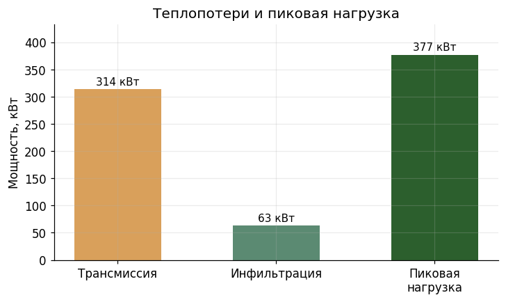
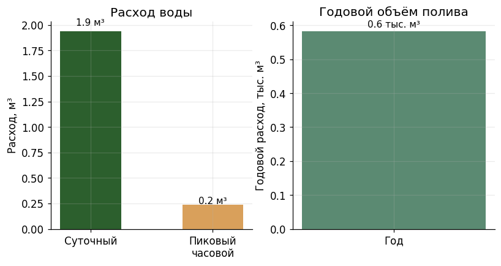
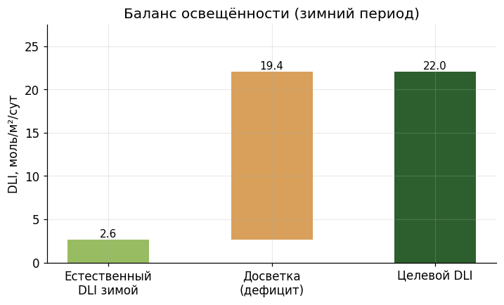
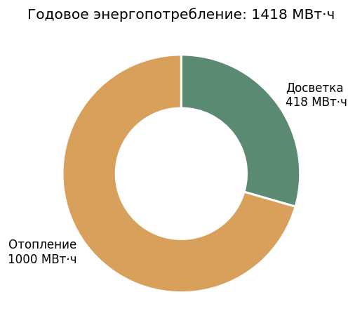

# Предпроектное решение: Тепличный комплекс «Заря»

**Регион:** Краснодарский край
**Тип теплицы:** year_round
**Культура:** tomato
**Целевая урожайность:** 500.0 т/год
**Дата генерации:** 2026-06-11 07:55

---

## 1. Исходные данные и анализ участка

Целевая урожайность относительно участка: 25.0 кг/м²/год

**Климатические параметры (СП 131.13330):**

| Параметр | Значение |
| --- | --- |
| Расчётная зимняя температура (t5) | -19.0 °C |
| Расчётная летняя температура | 29.4 °C |
| Градусо-сутки отопления | 2510.0 |
| Длительность отопительного периода | 149 сут |
| Снеговая нагрузка | 1.0 кПа |
| Ветровая нагрузка | 0.38 кПа |
| Солнечная радиация (зимой) | 3.8 МДж/м²/сут |

---

## 2. Проектное решение (вариант v1)

**Обоснование:** Краснодарский край — тёплый регион (расчётная зимняя температура −19 °C, короткий отопительный период 149 дней). Томат на шпалере требует высоты конька ≥5,5 м для круглогодичной эксплуатации. Участок 200×100 м. Выбрана многопролётная блочная компоновка: 2 блока по 96×54 м (6 пролётов × 9 м), ориентация вдоль длины участка. Суммарный застройки ~10 368 м², что оставляет достаточно места для проездов, подсобных зон и нормативного разрыва между блоками. Покрытие — стекло 4 мм (τ=0,88), прямолинейный скат с уклоном 45%, цоколь 0,4 м, превышение фундамента 0,4 м. Расстояние до животноводческих объектов 1000 м >> 150 м (п. 4.6). Ограждение 1,8 м. Разрыв между двумя блоками: (100 − 54 − 54) / 1 = −8 м — не помещаются рядом по ширине, поэтому блоки размещаются вдоль длины участка с разрывом (200 − 96 − 96) / 1 = 8 м, что соответствует норме ≥6 м (п. 4.4). Подсобные зоны (котельная, склад, упаковка) — вдоль торца участка.

**Общая площадь под выращивание:** 10368 м²
**Площадь комплекса (с подсобками):** 10368.0 м²

### Блоки теплиц

- **Блок А** — 96.0 × 54.0 м (площадь 5184 м²)
  - Высоты: водосток 2.5 м, конёк 5.8 м
  - Компоновка: block, 6 пролётов по 9.0 м
  - Кровля: straight, уклон 45.0%
  - Ограждение: glass (τ=0.88), стекло 4.0 мм  - Доля светонепроницаемых конструкций: 14.0%
- **Блок Б** — 96.0 × 54.0 м (площадь 5184 м²)
  - Высоты: водосток 2.5 м, конёк 5.8 м
  - Компоновка: block, 6 пролётов по 9.0 м
  - Кровля: straight, уклон 45.0%
  - Ограждение: glass (τ=0.88), стекло 4.0 мм  - Доля светонепроницаемых конструкций: 14.0%

### Конструктивные параметры комплекса

| Параметр | Значение | Пункт СП |
| --- | --- | --- |
| Высота цоколя | 0.4 м | п. 5.8 |
| Превышение фундамента над почвой | 0.4 м | п. 5.9 |
| Высота ограждения территории | 1.8 м | п. 4.16 |

### Подсобные зоны

- **Котельная (электро-резервная + тепловые насосы)** — 120.0 м² (Теплоснабжение комплекса, резервное электроснабжение)
- **Склад агрохимии и инвентаря** — 80.0 м² (Хранение удобрений, средств защиты растений, инструмента)
- **Цех сортировки и упаковки** — 150.0 м² (Первичная обработка, сортировка и упаковка томатов)
- **Административно-бытовой блок** — 80.0 м² (Офис, раздевалки, санузлы, комната приёма пищи)
- **Площадка для транспорта и погрузки** — 200.0 м² (Манёвровая зона, весовая, временное хранение готовой продукции)

---

## 3. Инженерные расчёты

### 3.1. Теплоснабжение

- Расчётная разница температур: **37.0 °C**
- Площадь ограждающих конструкций: **13423.2 м²**
- Средневзвешенный коэффициент теплопередачи U: **6.4 Вт/(м²·К)**
- Трансмиссионные теплопотери: **3178.6 кВт**
- Инфильтрационные теплопотери: **635.7 кВт**
- **Пиковая тепловая нагрузка: 3814.3 кВт**
- Годовая потребность в тепле: **6210.2 МВт·ч**
- Температура теплоносителя: **95.0 °C** _(п. 7.9 ≤150)_
- Доля теплоты в нижнюю зону: **45.0%** _(п. 7.13 ≥40)_

### 3.2. Водоснабжение

- Суточный расход: **46.66 м³/сут**
- Пиковый часовой расход: **5.83 м³/ч**
- Годовой расход: **13997 м³/год**
- Способ полива: Капельное (по умолчанию)
- Категория надёжности: **II** _(п. 6.14)_
- Радиус зоны крана: **40.0 м** _(п. 6.8 ≤45)_

### 3.3. Освещённость и досветка

- Целевой DLI: **22.0 моль/м²/сут**
- Естественный DLI зимой: **6.7 моль/м²/сут**
- **Досветка требуется**: установленная мощность 210.5 Вт/м², расход 5203983 кВт·ч/год
- Освещённость пола в проездах: 8.0 лк _(п. 8.3 ≤10)_

### 3.4. Годовое энергопотребление

### 3.5. Вентиляция

- Целевая кратность воздухообмена летом: **60.0 ч⁻¹**
- Площадь проёмов от площади ограждения: **20.0%** _(п. 7.18 ≥20, ≥10 севернее 60°)_
- Площадь проёмов от площади пола: 25.9%
- Принудительная вентиляция: **не требуется**

### 3.6. Нагрузки

- Снеговая нагрузка на покрытие: **16692.0 кН** (γ=1.4)
- Ветровая нагрузка на стены: **456.0 кН** (q₁₀=1.0, q₂=0.6)
- Шпалерная нагрузка: 150.0 Н/м² (γ=1.3)
- Шпалерная нагрузка 150.0 Н/м² (γ=1.3).

_Коэффициенты перегрузки и нормативные значения — СП 107.13330 п. 5.14._

---

## 4. Проверка по СП 107.13330

Проверено правил: **20**

✓ Все проверяемые требования СП 107.13330 удовлетворены.

---

_Сгенерировано системой agro-greenhouse-designer. Расчёты — предпроектные, для последующей разработки рабочей документации требуется верификация специалистом-проектировщиком._