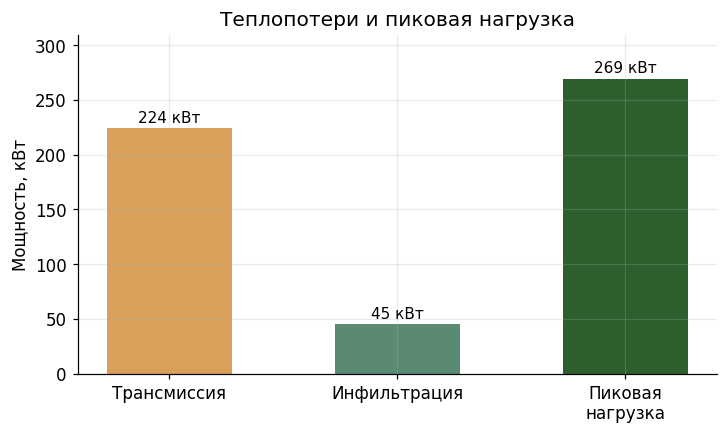
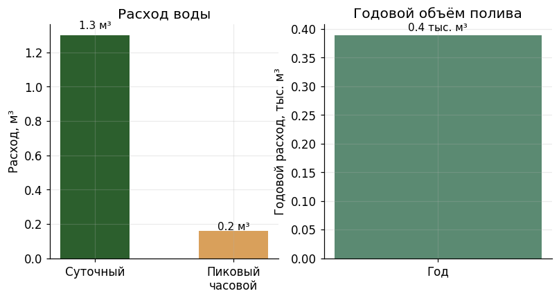
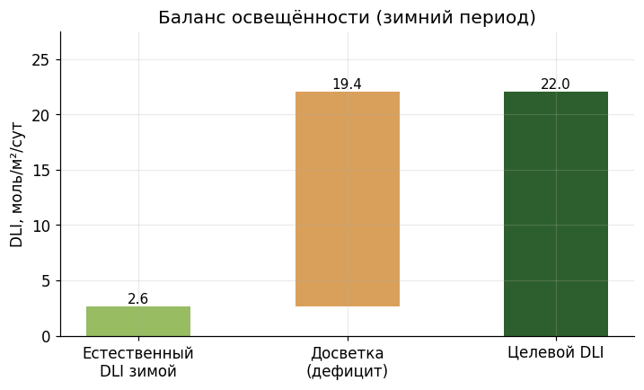
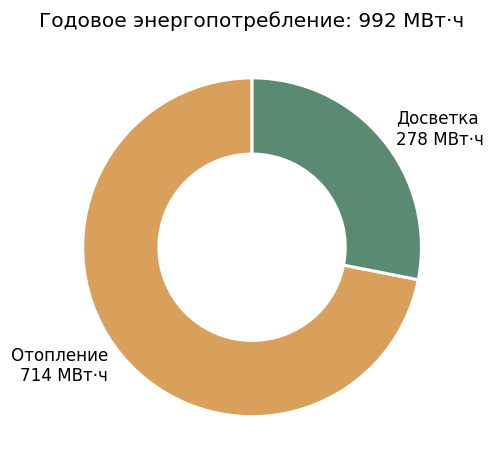

# Предпроектное решение: Тестовый отказ системы

**Регион:** Новосибирская область
**Тип теплицы:** year_round
**Культура:** tomato
**Целевая урожайность:** 2000.0 т/год
**Дата генерации:** 2026-06-10 08:26

---

## 1. Исходные данные и анализ участка

Целевая урожайность относительно участка: 4000.0 кг/м²/год
⚠ Целевая урожайность очень высокая — потребуется интенсивная технология.

**Климатические параметры (СП 131.13330):**

| Параметр | Значение |
| --- | --- |
| Расчётная зимняя температура (t5) | -37.0 °C |
| Расчётная летняя температура | 25.0 °C |
| Градусо-сутки отопления | 6076.0 |
| Длительность отопительного периода | 227 сут |
| Снеговая нагрузка | 2.4 кПа |
| Ветровая нагрузка | 0.3 кПа |
| Солнечная радиация (зимой) | 1.5 МДж/м²/сут |

---

## 2. Проектное решение (вариант failed_v1)

**Обоснование:** ТЗ заведомо противоречиво: участок всего 500 м² (25×20 м) при цели 2000 т/год томата — это нереалистичная плотность ~4000 кг/м²/год (типично 60-90 кг/м² для year-round). Также отсутствуют все инженерные сети (газ, вода, электричество) и грунтовые воды на глубине 0.5 м (потребуется дренаж/насыпь). В рамках имеющегося участка предлагаю максимально возможную компоновку: один блок с остеклением (макс. светопропускание для Новосибирска с низкой зимней инсоляцией 1.5 МДж/м²/день), высота конька 6.0 м под шпалерную культуру томата. Ширина 16 м и длина 18 м (кратна 6) дают 288 м² (57.6% участка — в пределах 75% лимита), остаток под обязательную котельную (нет газа — нужна резервная котельная на жидком/твёрдом топливе), склад и тарный участок. Снеговая нагрузка 2.4 кПа и расчётная зима -37°C учтены выбором стекла на усиленном металлокаркасе. ВНИМАНИЕ: достичь 2000 т/год на 288 м² невозможно — реалистично ~20-25 т/год; требуется пересмотр ТЗ.

**Общая площадь под выращивание:** 288 м²
**Площадь комплекса (с подсобками):** 288.0 м²

### Блоки теплиц

- **Блок 1 — томат (шпалерный, круглогодичный)** — 18.0 × 16.0 м (площадь 288 м²), высота 4.5/6.0 м, glass (τ=0.88)

### Подсобные зоны

- **Котельная** — 40.0 м² (Автономное теплоснабжение (газа нет, климат -37°C, 6076 ГСОП))
- **Склад субстрата и удобрений** — 25.0 м² (Хранение расходных материалов для гидропоники)
- **Тарный/упаковочный участок** — 20.0 м² (Сортировка и упаковка продукции)
- **Резервуар воды и насосная** — 15.0 м² (Водоснабжения нет — необходим запас воды и водоподготовка)
- **Дизель-генераторная** — 12.0 м² (Электроснабжения нет — автономное питание систем досветки и климата)

---

## 3. Инженерные расчёты

### 3.1. Теплоснабжение

- Расчётная разница температур: **55.0 °C**
- Площадь ограждающих конструкций: **637.2 м²**
- Средневзвешенный коэффициент теплопередачи U: **6.4 Вт/(м²·К)**
- Трансмиссионные теплопотери: **224.3 кВт**
- Инфильтрационные теплопотери: **44.9 кВт**
- **Пиковая тепловая нагрузка: 269.2 кВт**
- Годовая потребность в тепле: **713.6 МВт·ч**

### 3.2. Водоснабжение

- Суточный расход: **1.3 м³/сут**
- Пиковый часовой расход: **0.16 м³/ч**
- Годовой расход: **389 м³/год**
- Способ полива: Капельное (по умолчанию)

### 3.3. Освещённость и досветка

- Целевой DLI: **22.0 моль/м²/сут**
- Естественный DLI зимой: **2.6 моль/м²/сут**
- **Досветка требуется**: установленная мощность 266.2 Вт/м², расход 278449 кВт·ч/год

### 3.4. Годовое энергопотребление

### 3.5. Вентиляция

- Целевая кратность воздухообмена летом: **60.0 ч⁻¹**
- Площадь открываемых проёмов: **20.0% площади пола**
- Принудительная вентиляция: **не требуется**

### 3.6. Нагрузки

- Снеговая нагрузка на покрытие: **795.0 кН**
- Ветровая нагрузка на стены: **73.0 кН**

---

## 4. Проверка по СП 107.13330

Проверено правил: **12**

### WARNING — SP107.10.4

Минимальная ширина прохода между блоками теплиц — 6 м (для проезда техники).

- Фактическое значение: `0.0`
- Требуется: `6.0`
- **Источник:** СП 107.13330 п. 10.4:
> «Расстояния между зимними теплицами, входящими в состав ТОК и РОТК, 
определяются шириной проездов и составляют не менее 6 м, между сезонными 
теплицами - не менее 1,5 м.»

---

_Сгенерировано системой agro-greenhouse-designer. Расчёты — предпроектные, для последующей разработки рабочей документации требуется верификация специалистом-проектировщиком._